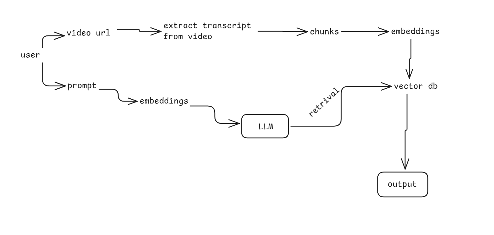

# 🎥 YouTube RAG Summarizer

A terminal-based YouTube video summarizer using **LangChain**, **OpenAI API**, and **FAISS** for Retrieval-Augmented Generation (RAG).



## 📋 Features

- **Fetch YouTube Transcripts**: Automatically retrieves video transcripts using `youtube-transcript-api`
- **Smart Text Chunking**: Splits transcripts into manageable chunks with `RecursiveCharacterTextSplitter`
- **OpenAI Embeddings**: Generates high-quality embeddings using OpenAI's text-embedding models
- **FAISS Vector Store**: Efficiently stores and retrieves relevant transcript segments
- **RAG Pipeline**: Combines retrieval with OpenAI's GPT models for accurate, context-aware responses
- **Custom Prompts**: Ask any question about the video content
- **Terminal-Based**: Simple, clean command-line interface
- **Multiple Language Support**: Automatically handles different language transcripts

## 🛠️ Tech Stack

- **Python 3.8+**
- **LangChain**: Framework for building LLM applications
- **OpenAI API**: For embeddings and language models
- **FAISS**: Vector database for efficient similarity search
- **youtube-transcript-api**: For fetching video transcripts

## 📦 Installation

### 1. Clone or Download the Project

```bash
git clone <repository-url>
cd youtube
```

### 2. Create a Virtual Environment (Recommended)

```bash
# Windows
python -m venv venv
venv\Scripts\activate

# macOS/Linux
python3 -m venv venv
source venv/bin/activate
```

### 3. Install Dependencies

```bash
pip install -r requirements.txt
```

### 4. Set Up Environment Variables

1. Get your OpenAI API key from [OpenAI Platform](https://platform.openai.com/api-keys)
2. Create a `.env` file in the project root:

```bash
# Copy the example file
copy .env.example .env  # Windows
# or
cp .env.example .env    # macOS/Linux
```

3. Add your API key to `.env`:

```
OPENAI_API_KEY=your_actual_openai_api_key_here
```

## 🚀 Usage

Run the script:

```bash
python youtube_rag_summarizer.py
```

### Example Session

```
============================================================
🎥 YouTube RAG Summarizer with Gemini & FAISS
============================================================

📝 Step 1: Enter YouTube Video URL
YouTube URL: https://www.youtube.com/watch?v=dQw4w9WgXcQ

📝 Step 2: Enter Your Prompt
Examples: 'Summarize the video', 'What are the key points?', 'Explain the main concepts'
Your prompt: Summarize the video in 3 key points

============================================================
🚀 Processing...
============================================================

📥 Fetching transcript for video ID: dQw4w9WgXcQ...
✅ Transcript fetched successfully! Length: 15234 characters
✂️  Splitting transcript into chunks (size=1000, overlap=200)...
✅ Transcript split into 18 chunks
✂️  Splitting transcript into chunks (size=1000, overlap=200)...
✅ Transcript split into 18 chunks
🔢 Generating embeddings using OpenAI...
✅ Vector store created successfully
🔗 Setting up RAG chain with OpenAI LLM...
✅ RAG chain created successfully
🤖 Generating response for: 'Summarize the video in 3 key points'...

============================================================
📄 RESPONSE
============================================================

[AI-generated summary appears here]

============================================================
✅ Process completed successfully!
============================================================
```

## 💡 Example Prompts

- **"Summarize the video"**
- **"What are the main topics discussed?"**
- **"Extract key points from this video"**
- **"Explain the concepts mentioned"**
- **"What solutions are proposed in the video?"**
- **"List the important takeaways"**

## 🔧 How It Works

1. **Input**: User provides YouTube URL and a custom prompt
2. **Transcript Extraction**: Fetches the video transcript using `youtube-transcript-api`
3. **Text Chunking**: Splits transcript into smaller chunks (1000 chars with 200 overlap)
4. **Embedding Generation**: Creates vector embeddings using Gemini's `embedding-001` model
5. **Vector Storage**: Stores embeddings in FAISS for fast similarity search
6. **Retrieval**: Finds the 4 most relevant chunks based on the user's prompt
7. **Generation**: Gemini Pro LLM generates a response using retrieved context
8. **Output**: Displays the AI-generated answer in the terminal

## 📁 Project Structure

```
youtube/
│
├── youtube_rag_summarizer.py  # Main application script
├── requirements.txt            # Python dependencies
├── .env.example               # Example environment file
├── .env                       # Your API key (create this)
└── README.md                  # This file
```

## ⚙️ Configuration

You can customize the following parameters in `youtube_rag_summarizer.py`:

- **Chunk Size**: Default 1000 characters (line 86)
- **Chunk Overlap**: Default 200 characters (line 86)
- **Retrieval Count**: Default 4 chunks (line 139)
- **LLM Temperature**: Default 0.3 for focused responses (line 127)

## 🐛 Troubleshooting

### "Transcript not available"
- The video may not have captions/subtitles
- Try a different video with available transcripts

### "API Key Error"
- Ensure your `.env` file exists and contains a valid `OPENAI_API_KEY`
- Check that you've activated the Gemini API in Google AI Studio

### "Module not found"
- Make sure you've installed all dependencies: `pip install -r requirements.txt`
- Verify your virtual environment is activated

## 📝 Notes

- The script requires an active internet connection
- Processing time depends on video length and transcript size
- Gemini API has rate limits on the free tier
- Not all YouTube videos have transcripts available

## 🔒 Security

- Never commit your `.env` file to version control
- Keep your API key private
- The `.env` file is included in `.gitignore` by default

## 📄 License

This project is open-source and available for educational purposes.

## 🤝 Contributing

Feel free to fork, modify, and improve this project!

---

**Built with ❤️ using LangChain, Gemini, and FAISS**
